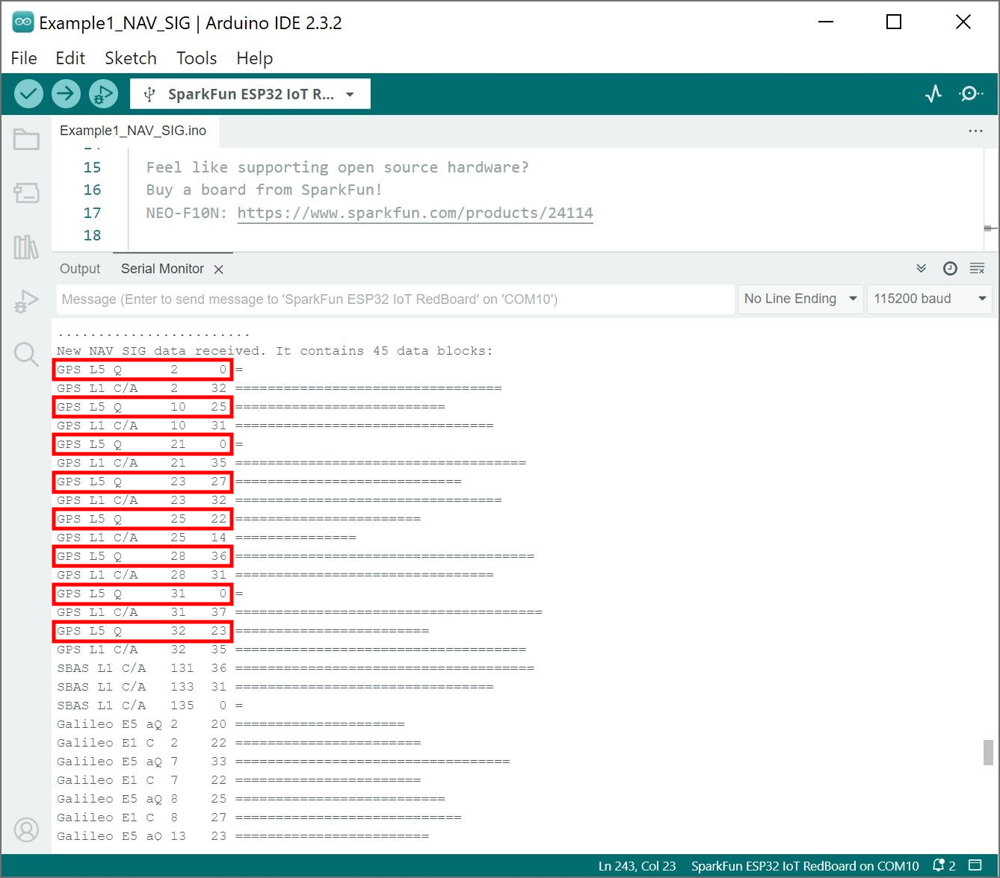

Now that we have our library and board add-on installed, we can get start experimenting with the breakout board. For the scope of this tutorial, we will highlight one of the examples to get started. From there we will be able to build our own custom code to integrate the development board into a project.

### Example 1: NAV-SIG

This example shows how to configure the NEO-F10N GNSS for L5 band and overriding the health status. The output will indicate the type of signals that the NEO-F10N is receiving. Head to the example in the **NEO-10N** folder (located in **File** **Examples** > **SparkFun u-blox GNSS V3** > **NEO-F10N** > **Example1_NAV-SIG**).

If you have not already, select your Board (in this case the **SparkFun ESP32 IoT RedBoard**), and associated COM port. Upload the code to the board and set the [Arduino Serial Monitor](https://learn.sparkfun.com/tutorials/terminal-basics/all#arduino-serial-monitor-windows-mac-linux) to **115200** baud. Give the NEO-F10N a few minutes to get a satellite lock. The signals available will be output in the Serial Monitor. If everything goes well, you should see some L5 signals (highlighted in red).

  <table>
    <tr style="vertical-align:middle;">
     <td style="text-align: center; vertical-align: middle;"></td>
    </tr>
  </table>

### More Examples!

Now that you got it up and running, check out the other examples located in the ZED-F10N folder!

<a href="https://github.com/sparkfun/SparkFun_u-blox_GNSS_v3/tree/main/examples/NEO-F10N" target="github_gnss_v3" class="md-button">SparkFun_u-blox_GNSS_v3 > examples > NEO-F10N</a>

