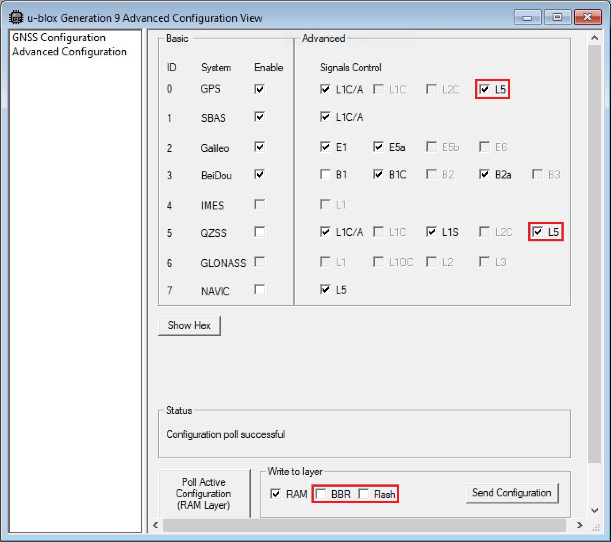
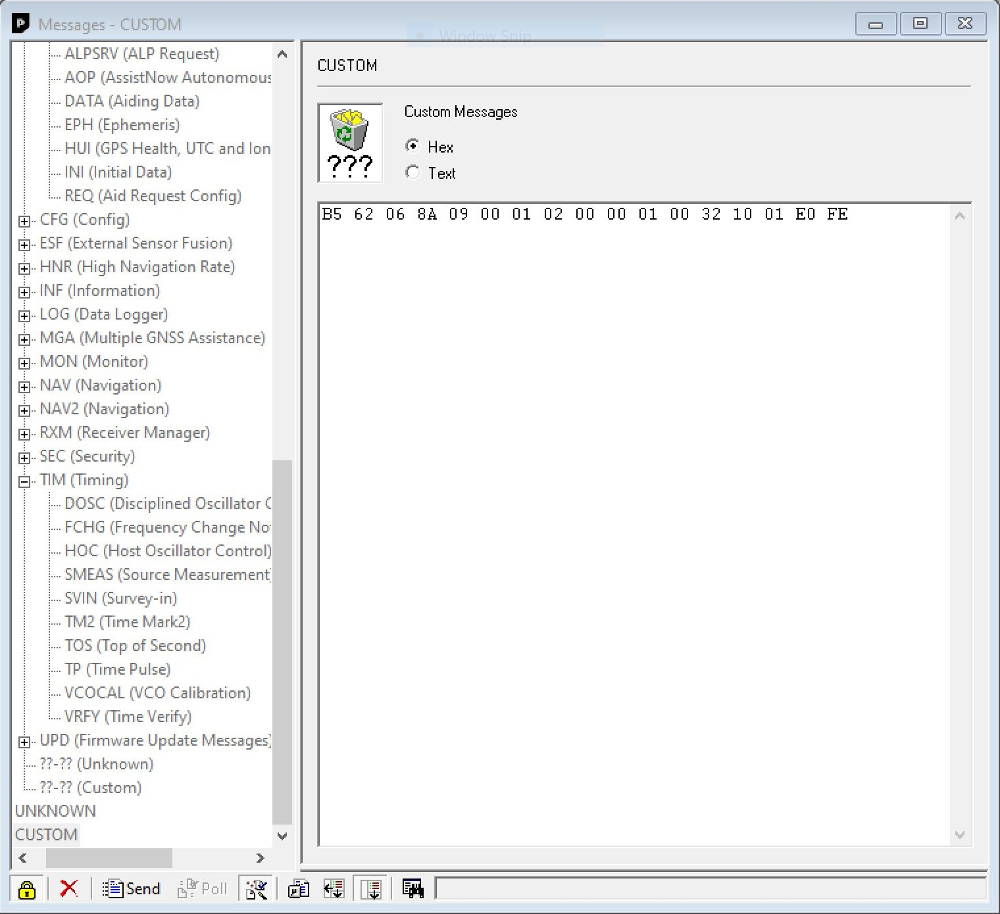
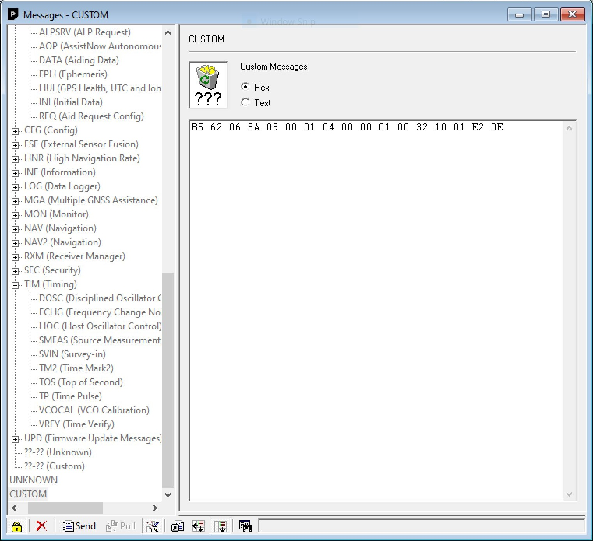
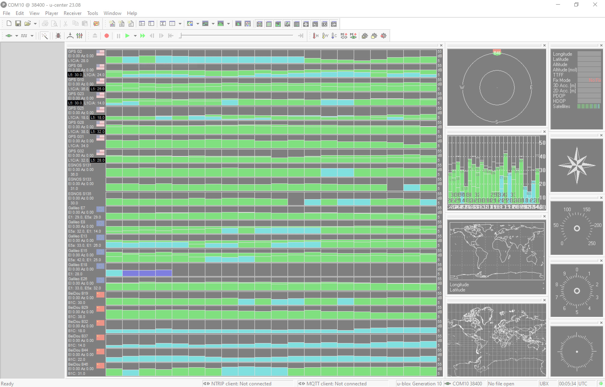

By default, the L5 band is disabled on the NEO-F10N. To take advantage of the L5 band, you will need to:

* enable the L5 band
* override the health status check
* save the settings into memory
* perform a software reset


### Configuring with the Arduino Library

!!! arduino
    Make sure that you are using the SparkFun u-blox GNSS Arduino Library **v3.1.1+** in order to be able to take advantage of the following functions.

To do this using the Arduino Library, users can add   `myGNSS.setVal8(UBLOX_CFG_SIGNAL_GPS_L5_ENA, 1)`, `myGNSS.setGPSL5HealthOverride(true)`, and `myGNSS.softwareResetGNSSOnly()` in the `setup()` function after connecting an Arduino to the NEO-F10N's hardware UART. You will notice this at the end of the `setup()` function under the **Example1_NAV_SIG.ino** example.

```c
  myGNSS.setUART1Output(COM_TYPE_UBX); //Set the UART1 port to output UBX only (turn off NMEA noise)
  myGNSS.saveConfigSelective(VAL_CFG_SUBSEC_IOPORT); //Save (only) the communications port settings to flash and BBR

  myGNSS.setMeasurementRate(5000); //Produce one solution every five seconds (NAV SIG produces a _lot_ of data!)

  myGNSS.setVal8(UBLOX_CFG_SIGNAL_GPS_L5_ENA, 1); // Make sure the GPS L5 band is enabled (needed on the NEO-F9P)

  myGNSS.setGPSL5HealthOverride(true); // Mark L5 signals as healthy - store in RAM and BBR

  myGNSS.setLNAMode(SFE_UBLOX_LNA_MODE_NORMAL); // Set the LNA gain to normal (full). Other options: LOWGAIN, BYPASS

  myGNSS.softwareResetGNSSOnly(); // Restart the GNSS to apply the L5 health override

  myGNSS.setAutoNAVSIGcallbackPtr(&newSIG); // Enable automatic NAV SIG messages with callback to newSIG
```


### Configuring with U-Center

Users can also enable the L5 band via U-Center v22.07. Connect a USB cable between the NEO-F10N breakout board and your computer. Then open the software, connect to the COM port that the board enumerated to, and head to **View** > **Generation 9 Configuration View**. Once open, select the check box for GPS's **L5**. Select the check box for **BBR** and **Flash**. When ready, hit the **Send Configuration** button.

<div style="text-align: center;">
  <table>
    <tr style="vertical-align:middle;">
     <td style="text-align: center; vertical-align: middle;"><a href="../assets/img/u-center_enable_L5_Highlighted.jpg"></a></td>
    </tr>
  </table>
</div>

To override the health status by heading to **View** > **Messages View** > **CUSTOM**. With the Custom Messages set for **Hex**, paste the following to configure the settings in **BBR** and hit the send button:

``` bash
B5 62 06 8A 09 00 01 02 00 00 01 00 32 10 01 E0 FE
```

<div style="text-align: center;">
  <table>
    <tr style="vertical-align:middle;">
     <td style="text-align: center; vertical-align: middle;"><a href="../assets/img/u-center_L5_Health_Status_BBR.JPG"></a></td>
    </tr>
  </table>
</div>


Then send the following to configure the settings in **FLASH** and hit the send button:

``` bash
B5 62 06 8A 09 00 01 04 00 00 01 00 32 10 01 E2 0E
```

<div style="text-align: center;">
  <table>
    <tr style="vertical-align:middle;">
     <td style="text-align: center; vertical-align: middle;"><a href="../assets/img/u-center_L5_Health_Status_Flash.JPG"></a></td>
    </tr>
  </table>
</div>

!!! tip
    To confirm that the above UBX messages were sent successfully, check the `UBX-ACK-ACK` messages after sending the message. For users that want to revert to the default behavior, make sure to check the **[NEO-F10N Integration Manual under "2.1.4 GPS L5 signal health status configuration" section](../assets/component_documentation/NEO-F10N_IntegrationManual_UBXDOC-963802114-12193.pdf)** page 10 under *Table 5: UBX binary strings to revert the GPS L5 signal health status monitoring to default*.

Ensure that the configuration is saved in BBR and Flash using the UBX-CFG-VALSET. Then send a UBX-CFG-RST message with resetMode 0x01 to apply the configuration stored in the BBR and flash layers.

The "Satellite Level History" window should update and include the L5 bands if it is available.

<div style="text-align: center;">
  <table>
    <tr style="vertical-align:middle;">
     <td style="text-align: center; vertical-align: middle;"><a href="../assets/img/U-Center_L5_Band_Satellite_Level_History-Highlighted.JPG"></a></td>
    </tr>
  </table>
</div>
