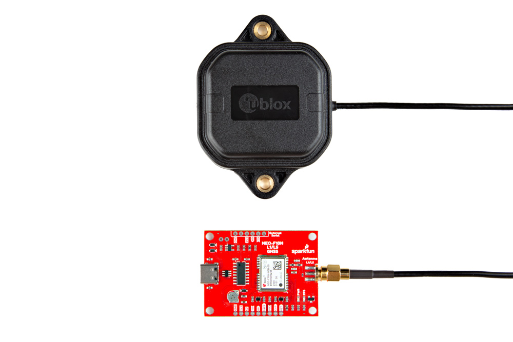
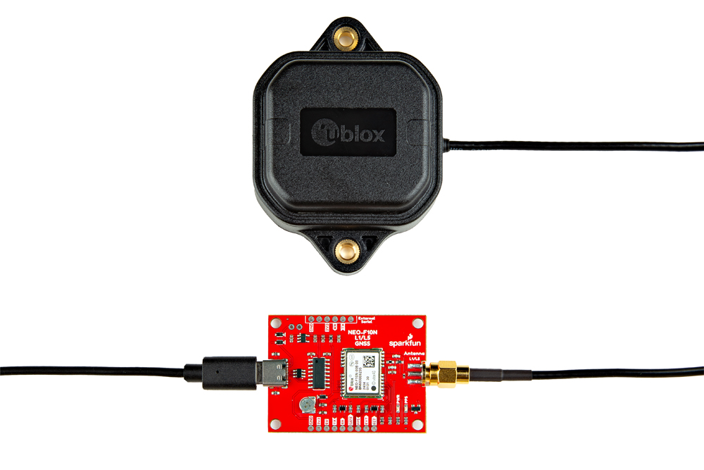
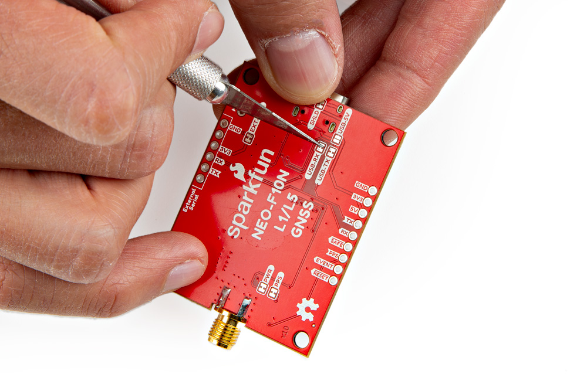
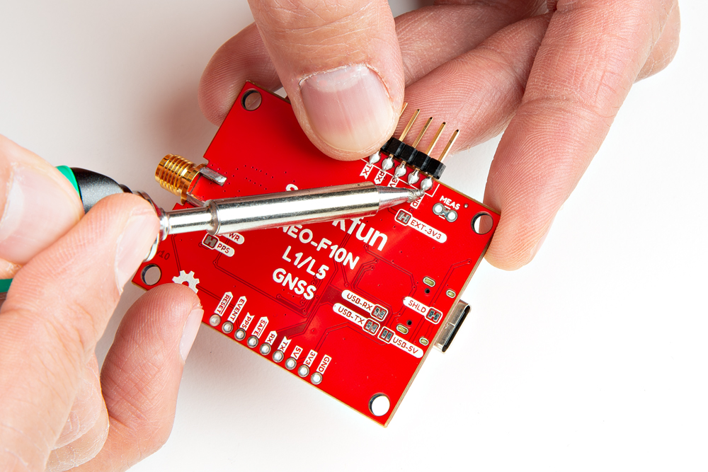
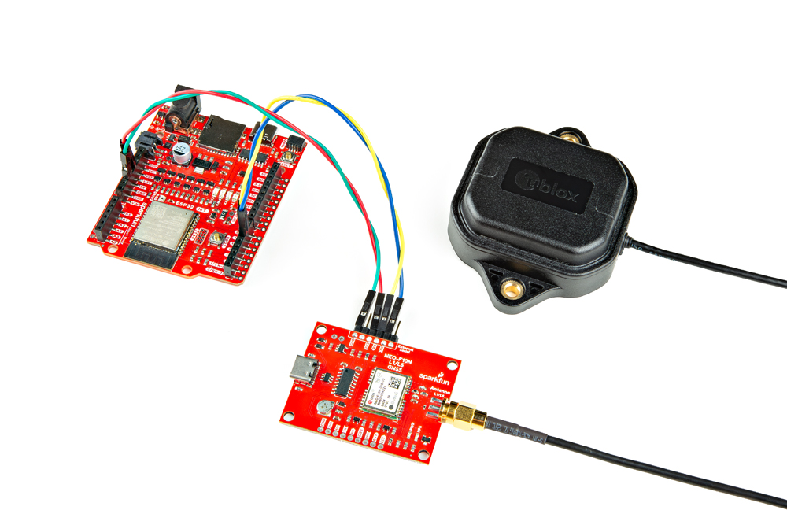
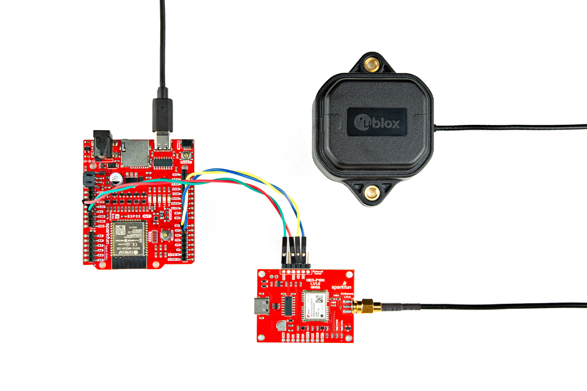
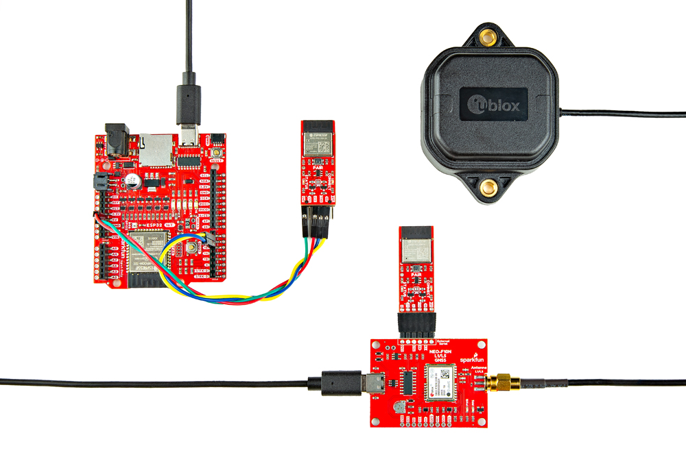

In this section, we'll go over how to connect the L1/L5 GNSS Antenna to the SparkFun GNSS L1/L5 Breakout - NEO-F10N. Depending on your application, you can connect the SparkFun GNSS L1/L5 Breakout - NEO-F10N directly to your computer.  For embedded application, you will want to connect the SparkFun GNSS L1/L5 Breakout - NEO-F10N to the IoT RedBoard - ESP32.

### L1/L5 Dual-Band GNSS Antenna

Connect a compatible dual-band antenna that is capable of receiving L1 and L5 bands. In this case, we used the "GNSS L1/L5 Multi-Band High Precision Antenna - 5m (SMA)." Insert the SMA side of the interface cable into the GNSS L1/L5 Breakout Board's SMA connector. Secure the connection by using the SMA's hex nut until it is finger-tight.

  <table>
    <tr style="vertical-align:middle;">
     <td style="text-align: center; vertical-align: middle;"></td>
    </tr>
  </table>

You will need to include an [antenna ground plate](https://www.sparkfun.com/products/17519) to get the most of the multi-band antenna. For the following images below, we'll have the magnetic mount antenna separate from the antenna ground plate when connecting the NEO-F10N breakout board to the rest of the system. When running the examples, make sure to have the antenna mounted over a metal ground plate.

  <table>
    <tr style="vertical-align:middle;">
     <td style="text-align: center; vertical-align: middle;"></td>
    </tr>
  </table>

!!! note
    Not all multiband antennas are made the same! Make sure that you are connecting a multi-band antenna that is capable of receiving L1/L5 signals when using the SparkFun GNSS L1/L5 Breakout - NEO-F10N. There is also another u-blox antenna that looks the same. However, the u-blox antenna used in this tutorial receives L1/L5 signals as opposed to the L1/L2.

### USB to NEO-F10N

For users that simply want to connect to the board via USB, you will just need to insert a USB C cable into the USB connector. Then connect the other end to your computer's USB port.

  <table>
    <tr style="vertical-align:middle;">
     <td style="text-align: center; vertical-align: middle;"></td>
    </tr>
  </table>

### Connecting via UART Port

!!! note
    We recommend using the IoT RedBoard - ESP32 for the scope of this tutorial.

For users that are connecting to a microcontroller, you will need to adjust the jumpers and solder to the PTH before connecting to the SparkFun GNSS L1/L5 Breakout - NEO-F10N.

#### Cutting the Serial Jumpers

For this example, we will connect the NEO-F10N to the IoT RedBoard - ESP32. Remember, the NEO-F10N has only one UART. You will need to cut the two jumpers on the back of the board labeled as USB-RX and USB-TX so that there is no [bus contention](https://learn.sparkfun.com/tutorials/serial-communication/common-pitfalls).

  <table>
    <tr style="vertical-align:middle;">
     <td style="text-align: center; vertical-align: middle;"></td>
    </tr>
  </table>

#### Connecting via PTH

Once the jumpers have been cut, you will need to solder to the through hole pins. For temporary connections to the PTHs, you could use IC hooks to test out the pins. However, you'll need to solder headers or wires of your choice to the board for a secure connection. You can choose between a combination of [header pins and jumper wires](https://learn.sparkfun.com/tutorials/how-to-solder-through-hole-soldering/all), or [stripping wire and soldering the wire](https://learn.sparkfun.com/tutorials/working-with-wire/all) directly to the board.

-   <a href="https://learn.sparkfun.com/tutorials/how-to-solder-through-hole-soldering/all">
      <figure markdown>
        
      </figure>
    </a>

    ---

    <a href="https://learn.sparkfun.com/tutorials/how-to-solder-through-hole-soldering/all">
      <b>How to Solder: Through Hole Soldering</b>
    </a>
<!-- ----------WHITE SPACE BETWEEN GRID CARDS---------- -->

-   <a href="https://learn.sparkfun.com/tutorials/working-with-wire/all">
      <figure markdown>
        
      </figure>
    </a>

    ---

    <a href="https://learn.sparkfun.com/tutorials/working-with-wire/all">
      <b>Working with Wire</b>
    </a>
<!-- ----------WHITE SPACE BETWEEN GRID CARDS---------- -->

We decided to solder straight header pins to the 1x6 External Serial port. Your setup will look similar to the image below.

  <table>
    <tr style="vertical-align:middle;">
     <td style="text-align: center; vertical-align: middle;"></td>
    </tr>
  </table>

You will then need to connect power and the UART pins between the boards. Below is an example of connecting the IoT RedBoard - ESP32's second hardware UART port. When initializing the serial, make sure to define your microcontroller's hardware serial, such as `Serial1` or `Serial2`. In this case, we needed to use UART2 for the IoT RedBoard - ESP32.

    <table>
        <tr>
            <th style="text-align: center; border: solid 1px #cccccc;">IoT RedBoard - ESP32
            </th>
            <th style="text-align: center; border: solid 1px #cccccc;">SparkFun GNSS L1/L5 Breakout - NEO-F10N
            </th>
        </tr>
        <tr>
            <td style="text-align: center; border: solid 1px #cccccc;" bgcolor="#f2dede">3.3V
            </td>
            <td style="text-align: center; border: solid 1px #cccccc;" bgcolor="#f2dede">3V3
            </td>
        </tr>
        <tr>        
            <td style="text-align: center; border: solid 1px #cccccc;" bgcolor="#d4edda">UART2_TX (D17)
            </td>
            <td style="text-align: center; border: solid 1px #cccccc;" bgcolor="#d4edda">RX
            </td>
        </tr>
        <tr>        
            <td style="text-align: center; border: solid 1px #cccccc;" bgcolor="#ffdaaf">UART2_RX (D16)
            </td>
            <td style="text-align: center; border: solid 1px #cccccc;" bgcolor="#ffdaaf">TX
            </td>
        </tr>
        <tr>
            <td style="text-align: center; border: solid 1px #cccccc;" bgcolor="#DDDDDD">GND
            </td>
            <td style="text-align: center; border: solid 1px #cccccc;" bgcolor="#DDDDDD">GND
            </td>
        </tr>
    </table>

  <table>
    <tr style="vertical-align:middle;">
     <td style="text-align: center; vertical-align: middle;"></td>
    </tr>
  </table>

!!! note
    Note that some microcontrollers may not have enough memory and will not be compatible with the SparkFun u-blox GNSS Arduino Library v3 (i.e. ATmega328P on the RedBoard Plus and the Arduino Uno). There are also some microcontrollers that only have one hardware UART so you need to make sure that there are only two serial devices on the bus.

#### USB to Microcontroller

To power and program the IoT RedBoard - ESP32, users will just need to insert the Type C side of the cable to the development board. The other end will connect to a computer's USB port.

  <table>
    <tr style="vertical-align:middle;">
     <td style="text-align: center; vertical-align: middle;"></td>
    </tr>
  </table>

#### Connecting a Pair of BlueSMiRF V2s

For users that want have a wireless connecting between the IoT RedBoard - ESP32 and the SparkFun GNSS L1/L5 Breakout Board - NEO-F10N, you could add a pair of BlueSMiRF V2s.

  <table>
    <tr style="vertical-align:middle;">
     <td style="text-align: center; vertical-align: middle;"></td>
    </tr>
  </table>

If you have not already, check out the [tutorial on the BlueSMiRFs](https://docs.sparkfun.com/SparkFun_BlueSMiRF-v2/introduction/) if you decide to wireless transmit the data.
