In this section, we will highlight the hardware and pins that are broken out on the SparkFun GNSS L1/L5 Breakout - NEO-F10N, SMA. For more information, check out our [Resources and Going Further](../resources/) for the NEO-F10N.

  <table>
    <tr style="vertical-align:middle;">
     <td style="text-align: center; vertical-align: middle; border: solid 1px #cccccc;><a href="../assets/img/GPS-24114-GNSS_L1_L5_Breakout_NEO-F10N_Top.jpg">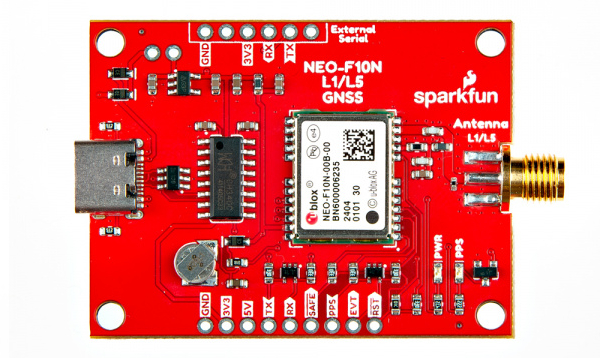</a></td>
     <td style="text-align: center; vertical-align: middle; border: solid 1px #cccccc;><a href="../assets/img/GPS-24114-GNSS_L1_L5_Breakout_NEO-F10N_Bottom.jpg">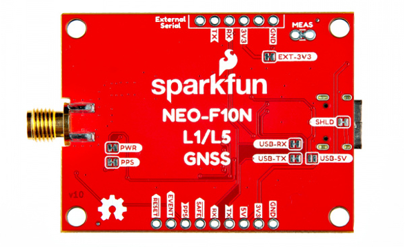</a></td>
    </tr>
    <tr style="vertical-align:middle;">
     <td style="text-align: center; vertical-align: middle; border: solid 1px #cccccc;"><i>Top View</i></td>
     <td style="text-align: center; vertical-align: middle; border: solid 1px #cccccc;"><i>Bottom View</i></td>
    </tr>
  </table>

### NEO-F10N Module

The board breaks out the NEO-F10N with some application circuits.

  <table>
    <tr style="vertical-align:middle;">
     <td style="text-align: center; vertical-align: middle; border: solid 1px #cccccc;><a href="../assets/img/GPS-24114-GNSS_L1_L5_Breakout_NEO-F10N_Module_u-blox.jpg">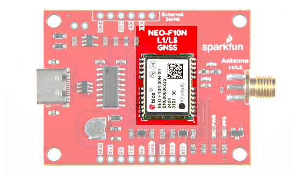</a></td>
    </tr>
    <tr style="vertical-align:middle;">
     <td style="text-align: center; vertical-align: middle; border: solid 1px #cccccc;"><i>u-blox NEO-F10N Module</i></td>
    </tr>
  </table>

Similar to the other u-blox engines, the NEO-F10N is a GNSS Receiver. The module supports the concurrent reception of three GNSS systems: GPS, Galileo, and BeiDou. The NEO-F10N utilizes the L1/L5 bands as opposed to other u-blox modules that use L1/L2, such as the [NEO-M9N](https://www.sparkfun.com/products/17285).

  <table>
    <tr style="vertical-align:middle;">
     <td style="text-align: center; vertical-align: middle; border: solid 1px #cccccc;><a href="../assets/img/L1_L2_L5_Bands.png">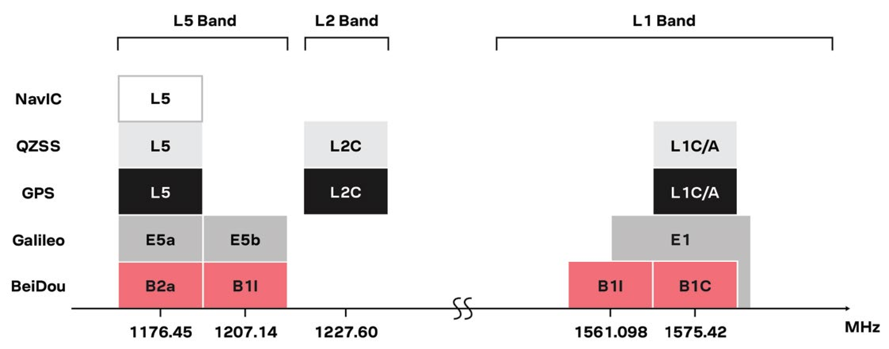</a></td>
    </tr>
    <tr style="vertical-align:middle;">
     <td style="text-align: center; vertical-align: middle; border: solid 1px #cccccc;"">Image Courtesy of <a href="../assets/component_documentation/GPS-signals-migration-wp.pdf">u-blox: GPS Signals Migration White Paper</a></td>
    </tr>
  </table>

Utilizing the L5 band, the NEO-F10N delivers improved performance under challenging urban environments because the L5 signals fall within the protected ARNS (aeronautical radio navigation service) frequency band. This band is less subject to RF interference. Below is a comparison of a single-band (L1) vs dual-band (L1/L5) GNSS test with a car driving through an urban environment. Tracking the vehicle was better when utilizing the L1/L5 bands.

  <table>
    <tr style="vertical-align:middle;">
     <td style="text-align: center; vertical-align: middle; border: solid 1px #cccccc;></td>
    </tr>
    <tr style="vertical-align:middle;">
     <td style="text-align: center; vertical-align: middle; border: solid 1px #cccccc;"><i>Image Courtesy of <a href="../assets/component_documentation/GPS-signals-migration-wp.pdf">u-blox: GPS Signals Migration White Paper</a></i></td>
    </tr>
  </table>

!!! note
    As of the writing of this tutorial, it is important to note that L5 band is still not yet fully operational on GPS and Galileo. It is expected to be fully operational by 2025.

The module can achieve meter-level accuracy with a satellite lock. Below are a few specs taken from the datasheet. For more information, check out the related [documents for the NEO-F10N in the Resources](../resources/).

* Time to First Fix: 28s (cold), 2s (hot)
* Max Navigation Rate for Single GNSS Configuration (GPS): 20 Hz
* Positional Accuracy (GPS): 1.5m
* Time Pulse Accuracy: 30ns
* Operational Limits
    * Max G: &le; 4G
    * Max Altitude: 80km (49.7 miles)
    * Max Velocity: 500m/s (1118mph)
* Software Configurable
    * Baud Rate (**38400 Baud**, default)
    * Odometer
    * Spoof Detection
    * External Interrupt
    * Pin Control
    * Many others!
* Supports: NMEA, UBX over UART

### Power

There are a variety of power and power-related nets broken out on the USB connector and through hole pads. **5V** power from the USB C Connector or PTH is regulated down to **3.3V** with the AP2112K 3.3V/600mA voltage regulator. The logic levels for the NEO-F10N is **3.3V** for the I/O pins.

* **5V** &mdash; Power from the USB C connector's VBUS provides power to the 5V bus. The 5V net is also connected to the edge PTH pin labeled as **5V** and the input of the 3.3V voltage regulator. Built-in Schottky diodes are included on the VBUS and 5V nets for protection. Make sure that power you provide to this pin does not exceed 6 volts.
* **3V3** &mdash; This connects to the 3.3V net. Both sides of the board includes a 3.3V pin (labeled as 3V3) that should only be provided with a clean 3.3V power signal.
* **GND** &mdash; Of course, is the common, ground voltage (0V reference) for the system.

  <table>
    <tr style="vertical-align:middle;">
     <td style="text-align: center; vertical-align: middle; border: solid 1px #cccccc;"><a href="../assets/img/GPS-24114-GNSS_L1_L5_Breakout_NEO-F10N_Power.jpg">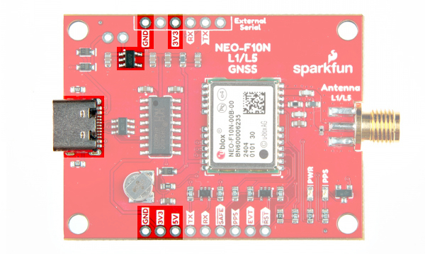</a></td>
    </tr>
    <tr style="vertical-align:middle;">
     <td style="text-align: center; vertical-align: middle; border: solid 1px #cccccc;"><i>Power from USB and PTHs</i></td>
    </tr>
  </table>

### Backup Battery

The small metal disk is a small lithium battery. This battery does not provide power to the IC like the 3.3V system does, but to relevant systems inside the IC that allow for a quick reconnection to satellites. The first time to fix (TTFF) is about **~28 seconds**. With the backup battery, the hot start is less than **2 seconds**.

  <table>
    <tr style="vertical-align:middle;">
     <td style="text-align: center; vertical-align: middle; border: solid 1px #cccccc;"><a href="../assets/img/GPS-24114-GNSS_L1_L5_Breakout_NEO-F10N_Backup_Battery.jpg">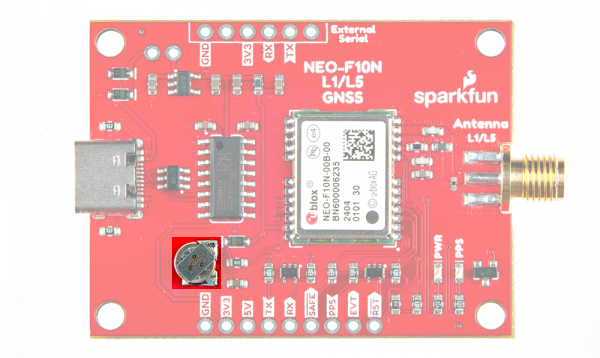</a></td>
    </tr>
    <tr style="vertical-align:middle;">
     <td style="text-align: center; vertical-align: middle; border: solid 1px #cccccc;"><i>Backup Battery Highlighted</i></td>
    </tr>
  </table>

### CH340C USB-to-Serial Converter

The board includes a built-in CH340 USB-to-serial converter to connect the board to a computer's USB port. This is useful for users viewing data, configuring the NEO-F10N, or updating firmware through u-center graphical user interface (GUI). Of course, users can also view the serial data through a serial terminal as well.

  <table>
    <tr style="vertical-align:middle;">
     <td style="text-align: center; vertical-align: middle; border: solid 1px #cccccc;"><a href="../assets/img/GPS-24114-GNSS_L1_L5_Breakout_NEO-F10N_USB_TVS_Diodes_CH340_USB-to-Serial_Converter.jpg">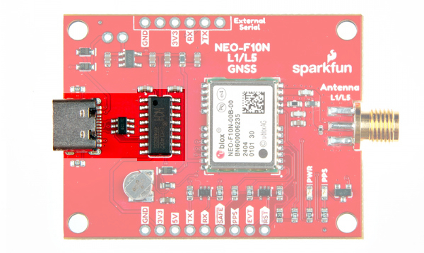</a></td>
    </tr>
    <tr style="vertical-align:middle;">
     <td style="text-align: center; vertical-align: middle; border: solid 1px #cccccc;"><i>USB, TVS Diodes, and CH340 Highlighted</i></td>
    </tr>
  </table>

### UART1

There are two pins on each row of headers currently labeled as **TX** and **RX** for the UART. Compared to other u-blox modules, there is no USB, I2C, SPI, or secondary UART port. The NEO-F10N has only one serial UART port available. The default baud rate is set to **38400 baud**, 8-bits, no parity, and 1 stop bit. The NEO-F10N is set to output the following messages by default: NMEA GGA, GLL, GSA, GSV, RMC, VTG and TXT.

* **TX** &mdash; TX out from the NEO-F10N
* **RX** &mdash; RX into the NEO-F10N

  <table>
    <tr style="vertical-align:middle;">
     <td style="text-align: center; vertical-align: middle; border: solid 1px #cccccc;"><a href="../assets/img/GPS-24114-GNSS_L1_L5_Breakout_NEO-F10N_Serial_UART.jpg">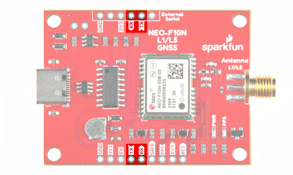</a></td>
    </tr>
    <tr style="vertical-align:middle;">
     <td style="text-align: center; vertical-align: middle; border: solid 1px #cccccc;"><i>UART Pins Highlighted</i></td>
    </tr>
  </table>

These pins are currently tied to the CH340's UART pins. For users connecting the board's serial UART pins to a microcontroller or radio, you will need to cut the USB-TX and USB-RX jumpers to avoid [bus contention](https://learn.sparkfun.com/tutorials/serial-communication/common-pitfalls).  

The 1x6 header labeled as "External Serial" can be used to connect to any other serial device that has a standard serial UART header. For example, you can connect a BlueSMiRF v2 wirelessly stream serial data using SPP to a smartphone's Bluetooth&reg; or a second BlueSMiRF.

  <table>
    <tr style="vertical-align:middle;">
     <td style="text-align: center; vertical-align: middle; border: solid 1px #cccccc;"><a href="../assets/img/GPS-24114-GNSS_L1_L5_Breakout_NEO-F10N_External_Serial_USB.jpg">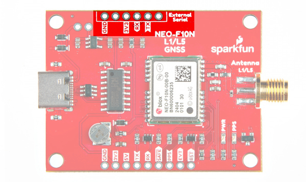</a></td>
    </tr>
    <tr style="vertical-align:middle;">
     <td style="text-align: center; vertical-align: middle; border: solid 1px #cccccc;"><i>External Serial Highlighted</i></td>
    </tr>
  </table>

### SMA Connector

The board is populated with one SMA connector for a secure connection. You will need a multiband GNSS antenna capable of receiving L1 and L5 bands to get the most out of the NEO-F10N. Note that this is intended for active antennas. We recommend using the
[GNSS L1/L5 Multi-Band High Precision Antenna - 5m (SMA)](https://www.sparkfun.com/products/23814). You will also need an [antenna ground plate](https://www.sparkfun.com/products/17519)

  <table>
    <tr style="vertical-align:middle;">
     <td style="text-align: center; vertical-align: middle; border: solid 1px #cccccc;"><a href="../assets/img/GPS-24114-GNSS_L1_L5_Breakout_NEO-F10N_SMA_Connector.jpg">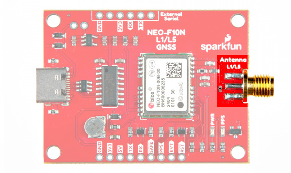</a></td>
    </tr>
    <tr style="vertical-align:middle;">
     <td style="text-align: center; vertical-align: middle; border: solid 1px #cccccc;"><i>SMA Connector Highlighted</i></td>
    </tr>
  </table>

### Broken Out Pins

There are four other pins broken out:

* **SAFE** &mdash; Safeboot input pin. This is required for firmware updates to the module and generally should not be used or connected.
* **PPS** &mdash; Pulse-per-second output pin. Begins blinking at 1Hz when module gets basic GPS/GNSS position lock.
* **EVENT** &mdash; Interrupt input/output pin. Can be configured using U-Center to bring the module out of deep sleep or to output an interrupt for various module states.
* **RST**/ **RESET** &mdash; Reset input pin. Pull this line low to reset the module.

  <table>
    <tr style="vertical-align:middle;">
     <td style="text-align: center; vertical-align: middle; border: solid 1px #cccccc;"><a href="../assets/img/GPS-24114-GNSS_L1_L5_Breakout_NEO-F10N_Other_Breakout_Pins.jpg">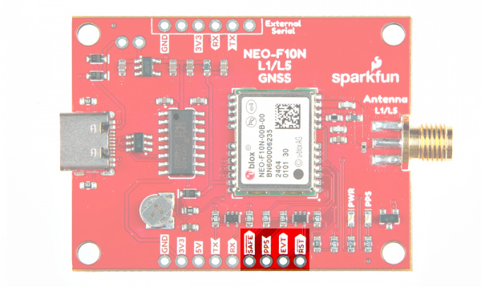</a></td>
    </tr>
    <tr style="vertical-align:middle;">
     <td style="text-align: center; vertical-align: middle; border: solid 1px #cccccc;"><i>Other Breakout Pins Highlighted</i></td>
    </tr>
  </table>

### LEDs

The board includes the following status LEDs as indicated in the image below.

* **PWR** &mdash; Indicates when the NEO-F10N is powered.
* **PPS** &mdash; Tied to the Pulse Per Second pin and acts as a visual indicator to the NEO-F10N's pulse per second signal.

  <table>
    <tr style="vertical-align:middle;">
     <td style="text-align: center; vertical-align: middle; border: solid 1px #cccccc;"><a href="../assets/img/GPS-24114-GNSS_L1_L5_Breakout_NEO-F10N_LEDs.jpg">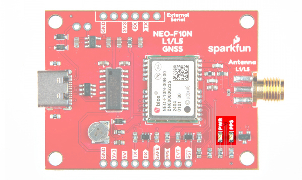</a></td>
    </tr>
    <tr style="vertical-align:middle;">
     <td style="text-align: center; vertical-align: middle; border: solid 1px #cccccc;"><i>LEDs Highlighted</i></td>
    </tr>
  </table>

### Jumpers

!!!note
    If this is your first time working with jumpers, check out the [How to Work with Jumper Pads and PCB Traces](https://learn.sparkfun.com/tutorials/how-to-work-with-jumper-pads-and-pcb-traces/all) tutorial for more information.

If you flip the board over, you will notice a few jumper pads.

* **SHLD** &mdash; This jumper connects the USB Type C connector's shield pin to GND. By default, this is closed. Cut this to isolate the USB Type C connector's shield pin.
* **USB-5V** &mdash; This jumper connects the 5V net to the 5V VBUS net. By default, this is open. Add a solder blob to the jumper to connect 5V PTH to the USB's VBUS.
* **MEAS** &mdash; By default, the jumper is closed. You can cut this jumper and solder to the PTHs to measure the NEO-F10N's current draw from either the USB's VBUS or 5V net. Just make sure to close the jumper if you decide to still use power from the USB or the 5V pin.
* **USB-TX** &mdash; The USB-TX jumper connects the CH340 USB-to-Serial converter's RX pin to the  NEO-F10N's TX pin. As stated earlier, cut this trace when connecting another serial device on the PTH to avoid bus contention.
* **USB-RX** &mdash; The USB-RX jumper connects the CH340 USB-to-Serial converter's TX pin to the  NEO-F10N's RX pin. As stated earlier, cut this trace when connecting another serial device on the PTH to avoid bus contention.
* **EXT-3V3** &mdash; This jumper connects 3.3V to the external serial port. By default, this is closed and will provide power to anything connected to the external serial port. To avoid conflicting voltages, cut this jumper if you are connecting 3.3V USB device with its own power source to the 1x6 header while the GNSS receiver is being powered with its own power source.
* **PWR** &mdash; The power LED will illuminate when 3.3V is activated either over USB or via the 3v3 pin. Cut this jumper to disable the LED.
* **PPS** &mdash; The pulse per second LED will illuminate each second once a position lock has been achieved. Cut this jumper to disable the LED.

  <table>
    <tr style="vertical-align:middle;">
     <td style="text-align: center; vertical-align: middle; border: solid 1px #cccccc;"><a href="../assets/img/GPS-24114-GNSS_L1_L5_Breakout_NEO-F10N_Jumpers-Top.jpg">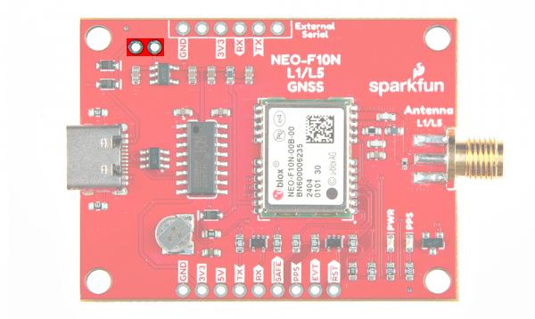</a></td>
     <td style="text-align: center; vertical-align: middle; border: solid 1px #cccccc;"><a href="../assets/img/GPS-24114-GNSS_L1_L5_Breakout_NEO-F10N_Jumpers-Bottom.jpg">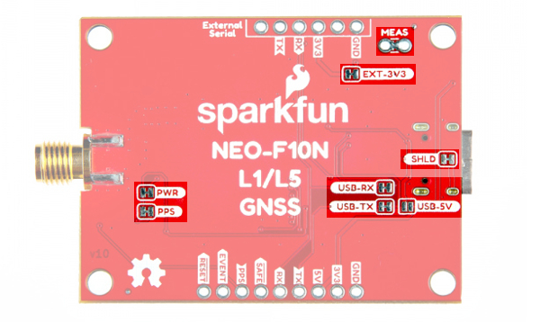</a></td>
    </tr>
    <tr style="vertical-align:middle;">
     <td style="text-align: center; vertical-align: middle; border: solid 1px #cccccc;"><i>MEAS PTH Highlighted - Top View</i></td>
     <td style="text-align: center; vertical-align: middle; border: solid 1px #cccccc;"><i>Jumpers Highlighted Highlighted - Bottom View</i></td>
    </tr>
  </table>

### 3D Model

3D models of the board and components were exported to STEP and STL files using KiCad.

<!-- Import the component -->

    <model-viewer src="../assets/3d_model/SparkFun_NEO-F10N_3D_model.glb" camera-controls poster="../assets/3d_model/SparkFun_NEO-F10N_3D_image.png" environment-image="legacy" shadow-intensity="1.58" exposure="0.64" shadow-softness="0.24" tone-mapping="neutral" camera-orbit="-46.67deg 57.14deg 153.3m" field-of-view="30deg" style="width: 750px; height: 500px;">
    </model-viewer>

 

    <a href="../assets/3d_model/SparkFun_NEO-F10N_3D_model.step" target="stp_file" class="md-button">Click Here for the STEP File</a>

### Board Dimensions

The board is 50.8mm x 38.1mm (2.0" x 1.5). This is not including the SMA connector. There are 4x mounting holes by each corner of the board for 4-40 screws and standoffs.

  <table>
    <tr style="vertical-align:middle;">
     <td style="text-align: center; vertical-align: middle; border: solid 1px #cccccc;"><a href="../assets/img/SparkFun_NEO-F10N-Board_Dimensions.jpg">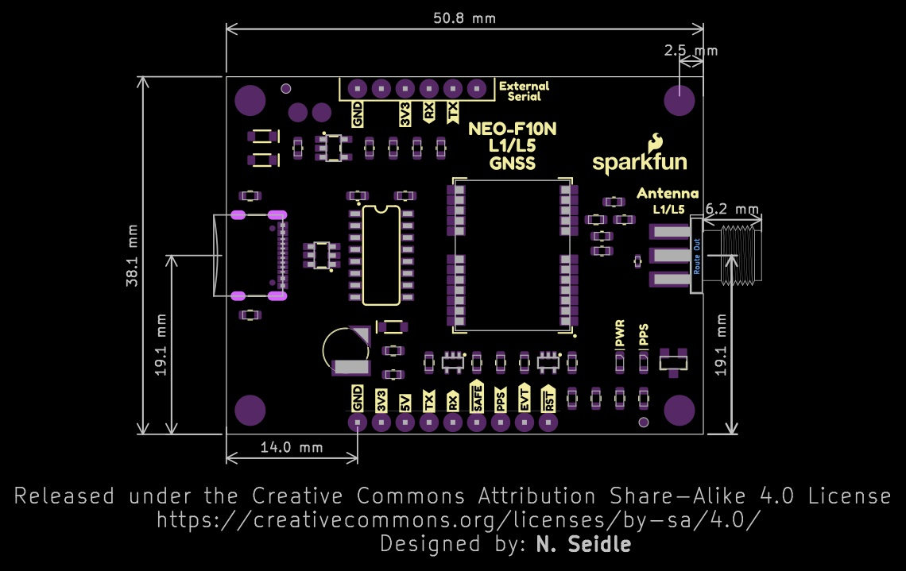</a></td>
    </tr>
    <tr style="vertical-align:middle;">
     <td style="text-align: center; vertical-align: middle; border: solid 1px #cccccc;"><i>Board Dimensions</i></td>
    </tr>
  </table>

